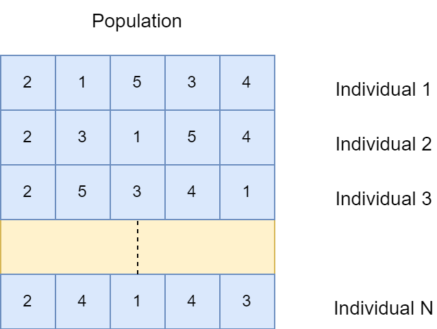
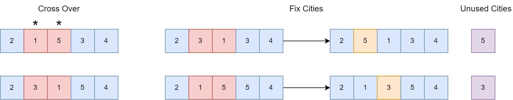
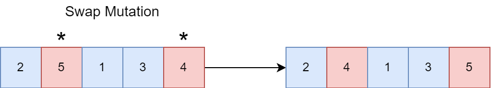

# Genetic Algorithm TSP
This project solves TSP problem by using genetic algorithm.

## Genetic Algorithm
I used object-oriented programming in this homework. I created a City class and store index, x
and y coordinates. Then, I created an Individual class. This class has list of cities and fitness value
(total distance of travel represented by the order of cities). Finally, I created a Population class
and it has list of individuals.

## Representation

I store cities in every individual and I store all individuals in the population. I choose any city for
starting point. Then, I generate solutions randomly. I begin start city and I end to the same city.

Example: For first individual, 2 -> 1 -> 5 -> 3 -> 4 -> 2

## GA Algorithm Design
### Initialize
Firstly, I initialize population randomly. So, I produce 150 solutions for population. Then, I
compute fitness value of all individuals.

### Cross Over
I choose best 16 parents and I make a couple of these parents. So, I produce 8 couples. Then, I
create new individuals (children) with crossover.

In my crossover, I generate a random value between 0 and 1. If the value is equal or upper than
0.5, gene is taken from first parent for first chromosome and from second parent for second
chromosome. If the value is lower than 0.5, gene is taken from second parent for first
chromosome and from first parent for second chromosome. All gene on a chromosome must be
unique, because the indexes of cities are unique. Hence, we must check whether chromosome
has same cities. If chromosome has same cities, we need to delete the duplicate city and an
unused city should be placed in this index.

### Mutation

After children are produced, I mutate all children. I choose swap mutation. Because, I try to
other mutation methods, but I got the best results with this mutation. In swap mutation, I select
random two index without start index (because I choose a start city, then I arrive to same city,
start city) and then I swap the values in these two randomly selected indexes.

### Survivor Selection
I find worst 16 individuals from the population and remove them. I placed the children in the
population of the worst individuals.
These processes continue with an arbitrary generation number. I try 1000, 2000 and 5000
generation.

### Results
Generation: 1000 → 1409.72
Generation: 2000 → 1186.75
Generation: 5000 → 1042.54

Also, I draw an graph. This graph is drawn for 5000 generation.

According to the graph, although my results were not very good at first, the results converged
to a better result during the time the genetic algorithm was running.
